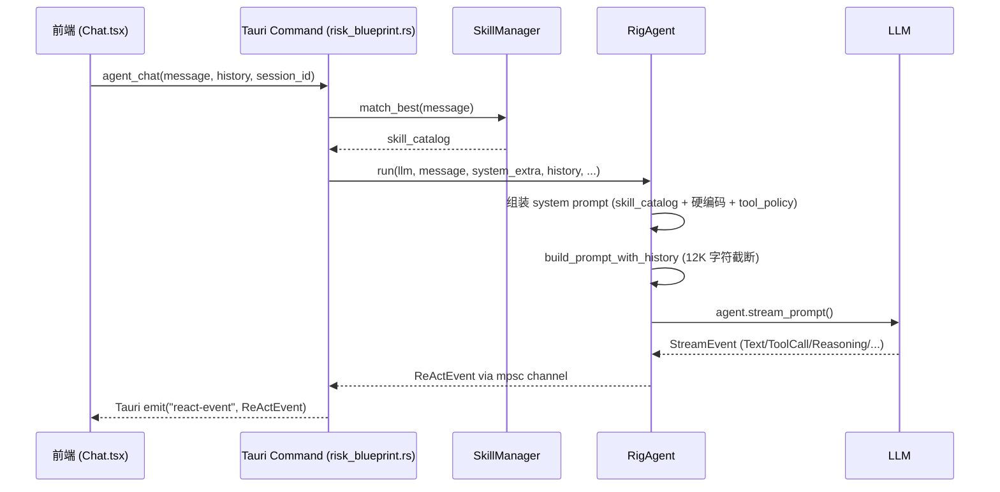

# KingdeeKB 架构文档

> 最后更新：2026-06-06

## 1. 项目概览

KingdeeKB 是一个基于 Tauri 的桌面 AI 助手应用，面向金蝶 ERP 开发场景，提供知识库问答、Agent 自动化、技能系统等功能。

**核心定位**：金蝶开发助手 — 集成了 RAG 知识检索、ReAct Agent、技能系统的桌面 AI 工具。

---

## 2. 技术栈

| 层 | 技术 |
|---|------|
| 桌面框架 | Tauri 2.x (Rust + WebView) |
| 前端 | React 19 + TypeScript + Vite |
| 后端 | Rust (tokio 异步运行时) |
| Agent 框架 | rig-core (Rust LLM 框架) |
| 向量检索 | fastembed (BGE-Small-ZH) + custom BM25 |
| LLM 提供商 | OpenAI、Anthropic、DeepSeek、Ollama (多供应商) |
| 持久化 | SQLite (via rusqlite) |
| 进程通信 | Tauri IPC (invoke/emit) |

---

## 3. 目录结构

```
KingdeeKB/
├── src/                          # 前端 (React + TypeScript)
│   ├── contexts/
│   │   └── AgentContext.tsx       # Agent 状态管理核心
│   ├── pages/
│   │   ├── Chat.tsx              # 主聊天页面
│   │   ├── Settings.tsx          # LLM/OCR/ASR 配置
│   │   ├── Skills.tsx            # 技能管理
│   │   └── RiskControl.tsx       # 风险控制
│   ├── lib/
│   │   ├── tauri-commands.ts     # Tauri IPC 封装
│   │   ├── skill-commands.ts     # 技能系统命令
│   │   └── skill-types.ts        # 技能类型定义
│   └── components/
│       ├── Layout.tsx            # 布局 + 侧边栏
│       └── Spotlight.tsx         # 全局快捷提问
│
├── src-tauri/                    # 后端 (Rust)
│   ├── src/
│   │   ├── commands/              # Tauri 命令层
│   │   │   ├── risk_blueprint.rs # agent_chat、cancel、answer_question
│   │   │   ├── llm_provider.rs   # LLM 供应商 CRUD
│   │   │   ├── skill.rs          # 技能命令 + process_image
│   │   │   ├── search_llm.rs     # count_tokens、RAG 搜索
│   │   │   └── core.rs           # 核心命令
│   │   ├── services/             # 服务层
│   │   │   ├── rig_agent.rs      # Agent 核心引擎 (ReAct)
│   │   │   ├── rig_tool.rs       # 工具定义 (12 个工具)
│   │   │   ├── rig_provider.rs   # LLM 客户端构建
│   │   │   ├── react_agent.rs    # ReActEvent 枚举定义
│   │   │   ├── llm_service.rs    # LLM 调用封装
│   │   │   ├── llm_providers.rs  # 多供应商管理
│   │   │   ├── prompt_assembler.rs # 技能提示词组装
│   │   │   ├── prompts.rs        # 系统提示词 (include_str!)
│   │   │   ├── tool_policy.rs    # 工具策略规则
│   │   │   ├── skill_manager.rs  # 技能扫描/匹配
│   │   │   ├── skill_loader.rs   # 技能加载器
│   │   │   ├── skill_executor.rs # 脚本执行引擎
│   │   │   ├── skill_trigger.rs  # 技能触发匹配
│   │   │   ├── skill_types.rs    # 技能类型定义
│   │   │   ├── question_tool.rs  # 澄清提问机制
│   │   │   ├── agent_timeout.rs  # 超时常量
│   │   │   ├── image_processor.rs # 图像处理
│   │   │   ├── embedding.rs      # 向量嵌入
│   │   │   ├── memory.rs         # 聊天记忆
│   │   │   └── traits.rs         # 服务抽象 trait
│   │   ├── app_state.rs          # 全局状态管理
│   │   └── lib.rs               # 模块注册
│   └── resources/
│       └── prompts/
│           └── system_prompt.md  # RAG 对话系统提示词
│
├── skills/                       # 用户安装的技能
├── docs/                         # 文档
│   └── superpowers/
│       ├── specs/                # 设计规格
│       └── plans/                # 实现计划
└── models/                       # 本地嵌入模型缓存
```

---

## 4. 前端架构

### 4.1 Agent 状态管理

```
AgentContext (React Context + Provider)
├── slots: Map<string, AgentSlot>    # 多槽位管理
├── sendMessage(slotId, text, opts)  # 发送消息
├── answerClarification()            # 回答澄清问题
├── cancelSession(slotId)            # 取消会话
└── clearSlot(slotId)               # 清空槽位
```

**Slot 系统**：支持 `"chat"`、`"risk-analysis"` 等多个独立对话槽位，每个槽位有独立的 `sessionId`、`messages` 和 `currentTrace`。

### 4.2 消息流

```
用户输入 → AgentContext.sendMessage()
    → buildAgentHistory() (截断到 12 条消息)
    → invoke("agent_chat", ...)
    → listenReActEvents() (SSE 事件流)
    → 更新 messages + currentTrace
```

### 4.3 持久化

- **消息存储**：localStorage，key=`kingdee_kb_chat_history`，最多 500 条
- **会话恢复**：页面刷新后从 localStorage 恢复消息列表
- **sessionId**：每次发送消息生成 `crypto.randomUUID()`，不持久化

---

## 5. 后端架构

### 5.1 Agent 执行流程

```
agent_chat (risk_blueprint.rs:310)
    │
    ├── 1. SkillManager.match_best(message)
    │      └── 匹配最佳技能，构建 skill_catalog
    │
    ├── 2. RigAgent::run(...)
    │      │
    │      ├── 2a. 多模态路由 (detect_images_in_message)
    │      ├── 2b. LLM 配置获取 (get_config_for_provider)
    │      ├── 2c. 系统提示词组装
    │      │     ├── skill_catalog (技能清单)
    │      │     ├── project_section (项目上下文)
    │      │     ├── 硬编码金蝶 ERP 提示词 (rig_agent.rs:171-264)
    │      │     └── tool_policy::agent_tool_policy_prompt()
    │      │
    │      ├── 2d. 历史组装 (build_prompt_with_history: 12K 字符截断)
    │      │
    │      ├── 2e. Provider 分支
    │      │     ├── OpenAI/Local → build_openai_client()
    │      │     └── Anthropic → build_anthropic_client()
    │      │
    │      └── 2f. agent.stream_prompt() → drain_stream()
    │
    └── 3. drain_stream() 循环
           │
           ├── Text → ReActEvent::TextDelta → SSE emit
           ├── ToolCall → 速率检查 + 死循环检测 → ReActEvent::ToolCall
           ├── Reasoning → ReActEvent::Thinking
           ├── ToolResult → ReActEvent::ToolResult
           ├── FinalResponse → ReActEvent::Done
           └── Error → 特殊处理 (MaxTurnError / 截断 / 超时)
```

### 5.2 核心类型

```rust
// SSE 事件 (react_agent.rs)
pub enum ReActEvent {
    Thinking { session_id, text },
    ToolCall { session_id, name, args },
    ToolResult { session_id, name, result },
    TextDelta { session_id, delta },
    Error { session_id, error },
    Done { session_id, text },
    Clarification { session_id, question_id, question },
}

// 消息 (llm_service.rs) — 当前结构，P0-a 后将扩展
pub struct ChatMessage {
    pub role: String,    // "system" | "user" | "assistant"
    pub content: String,
    // P0-a 将新增：
    // pub id: String,
    // pub token_count: Option<u32>,
}

// 供应商配置 (llm_providers.rs)
pub struct LLMProviderConfig {
    pub id: String,
    pub protocol: LLMProtocol,
    pub base_url: String,
    pub api_keys: Vec<ApiKeyConfig>,
    pub models: Vec<ModelConfig>,
    pub max_tokens: u32,    // ⚠️ 当前语义混乱，P0-f 将拆分为：
                            // ModelMetadata.context_window + ModelMetadata.max_output_tokens
}
```

---

## 6. 工具系统

### 6.1 静态工具 (all_rig_tools)

| 工具 | 类 | 有副作用 | 有重试 |
|------|-----|---------|--------|
| `search-knowledge` | SearchKnowledgeTool | 否 | ✅ 3次指数退避 |
| `check-scope-creep` | CheckScopeCreepTool | 否 | ✅ |
| `analyze-fit-gap` | AnalyzeFitGapTool | 否 | ✅ |
| `get-project-health` | GetProjectHealthTool | 否 | ✅ |
| `generate-defense-script` | GenerateDefenseScriptTool | 否 | ✅ |
| `extract-blueprint` | ExtractBlueprintTool | 否 | ✅ |
| `recommend-questions` | RecommendQuestionsTool | 否 | ✅ |
| `use-skill` | UseSkillTool | ✅ | ❌ 不重试 |

### 6.2 运行时工具 (runtime_rig_tools)

| 工具 | 功能 |
|------|------|
| `question` | 澄清提问 (阻塞等用户回答，5分钟超时) |
| `setup-skill-env` | 技能依赖安装 |
| `run-skill-script` | 技能脚本沙箱执行 |

### 6.3 安全约束

| 机制 | 阈值 |
|------|------|
| 死循环检测 | 连续 3 次相同调用 → 中断 |
| 工具速率限制 | 30 次/分钟 |
| 会话超时 | 10 分钟 |
| LLM 调用超时 | 120s |
| 流式首字节超时 | 30s |
| 工具执行超时 | 120s |
| 最大工具调用轮数 | 10,000 (名义上限) |
| 输出 token 限制 | 16K-32K (钳位) |

---

## 7. 上下文管理现状

### 7.1 四条独立管道

```
管道 A (RAG 对话):
  conversation → compress (2000 token 阈值) → assemble_context
  → build_user_prompt → desensitize → LLM

管道 B (Agent):
  history → build_prompt_with_history (12K 字符截断)
  → 系统提示词硬编码 → rig agent → LLM

管道 C (技能提示词):
  SkillManager.match_best → 手动拼接 → 作为 system_extra 注入 Agent

管道 D (交付物生成):
  use-skill → run-skill-script → 沙箱输出目录 → ProductStore
```

### 7.2 核心问题

| 问题 | 详述 |
|------|------|
| Token 计算不一致 | tiktoken (`u32`) vs 字符估算 (`usize`) vs 字符截断 |
| 双系统提示词 | llm_service.rs 硬编码 + prompts.rs include_str! |
| 管道割裂 | 各管道独立截断/压缩，无统一预算 |
| max_tokens 歧义 | 配置字段同时用作上下文窗口和输出限制 |
| 历史截断粗糙 | 12K 字符硬编码，不按 token 精确截断 |
| 压缩阈值过低 | 2000 tokens → 3-4 轮对话就触发 |
| 模型能力无感知 | 不知道实际上下文窗口大小 |

### 7.3 基础序列图



---

## 8. 未来架构（三层工程范式）

详见设计文档：[docs/superpowers/specs/2026-05-31-agent-engineering-paradigm-design.md](docs/superpowers/specs/2026-05-31-agent-engineering-paradigm-design.md)

```
┌─────────────────────────────────────────────────────┐
│  Harness Engineering 层                              │
│  架构约束 · 反馈循环 · 熵管理                          │
├─────────────────────────────────────────────────────┤
│  Plan-and-Execute 层                                 │
│  Planner → Executor → Replanner（复杂任务）           │
│  ReAct（简单任务 —— 现有模式保留）                      │
├─────────────────────────────────────────────────────┤
│  Context Engineering 层                              │
│  Token 精确计算 · 模型能力感知 · 动态预算分配          │
│  分层摘要 · 渐进式披露 · 模型元数据                    │
└─────────────────────────────────────────────────────┘
```

**关键新增模块**：

| 模块 | 文件 | 阶段 |
|------|------|------|
| `token.rs` | 统一 Token 计数 | P0-a |
| `types.rs` | 公共类型：AgentMode, BudgetPriority | P0-c |
| `model_metadata.rs` | 模型能力自动获取 | P0-b |
| `context_compressor.rs` | 分层摘要压缩 | P0-d |
| `agent_router.rs` | 模式路由 (ReAct vs Plan-Execute) | P1-a |
| `planner.rs` | Planner + Replanner | P1-b |
| `harness/constraints.rs` | 程序化约束 | P2-a |
| `harness/verifier.rs` | 结果验证 + 重试上限 | P2-b |
| `harness/entropy.rs` | 熵管理 | P2-c |
