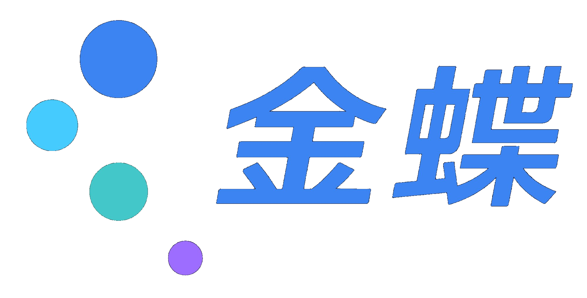
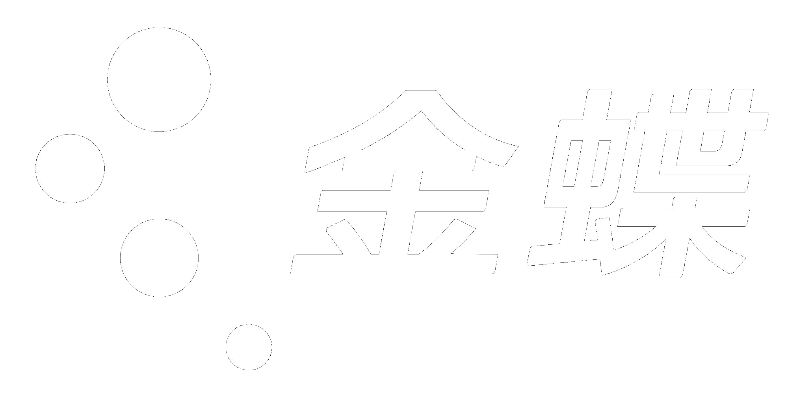

# 金蝶 HTML 幻灯片模板 Template v3.0

> **HTML-first 架构**：先做 HTML，再可选导出 PPTX。
> v3.0 新增：html2pptx.js 约束说明 — 若后续导出 PPTX，须遵守 4 条硬约束。
> v2.0 新增：deck_index.html 聚合器 + 响应式缩放 + Letterbox + 触摸导航增强。
> 基于 huashu-design 最佳实践，融入金蝶品牌规范。
> 与 `html-kingdee-style.md` 和 `html-kingdee-presets.md` 配合使用。

---

## html2pptx.js 4 条硬约束（⚠️ PPTX 导出必需）

> 若用户要求「可编辑 PPTX」，HTML 必须遵守以下 4 条约束。不遵守的 HTML 只能交付 HTML/PDF，无法导出 PPTX。

| 约束 | 说明 | 错误示例 | 正确示例 |
|------|------|----------|----------|
| **1. 固定尺寸** | body 固定 960pt × 540pt（匹配 LAYOUT_WIDE） | `width: 100vw` | `width: 960pt; height: 540pt` |
| **2. 文字包裹** | 所有文字在 `<p>/<h1>-<h6>/<ul>/<ol>` 里 | `<div>标题文字</div>` | `<h1>标题文字</h1>` |
| **3. 标签干净** | `<p>/<h*>` 不能有 background/border/shadow | `<p style="border-left: 3px solid red">` | `<div style="border-left: 3px solid red"><p>文字</p></div>` |
| **4. 禁用渐变** | 不用 CSS gradient、不用 background-image | `background: linear-gradient(...)` | 用 `` 或纯色背景 |

**验证方式**：`node scripts/export_deck_pptx.mjs --slides slides --out test.pptx`

**若导出失败**：脚本会列出具体错误，按提示修改 HTML。

---

## 架构选型决策树

```
│ 问：deck 预计有多少页？
├── ≤10 页、需要跨页共享状态、pitch deck → 单文件架构（Path A）
└── ≥10 页、学术讲座、课件、长 deck、多 agent 并行 → 多文件架构（Path B）
```

**默认推荐多文件架构**——CSS 天然隔离（iframe），一页出错不影响其他页，单页可直接双击验证。

---

## 完整 HTML 文件结构

```html
<!DOCTYPE html>
<html lang="zh-CN">
<head>
  <meta charset="UTF-8">
  <meta name="viewport" content="width=device-width, initial-scale=1.0">
  <title>{演示标题} | 金蝶</title>
  <style>
    /* ─── 第 1 部分：CSS 自定义属性（品牌色系）─── */
    /* 从 html-kingdee-style.md § 1 复制 */

    /* ─── 第 2 部分：视口锁定基础样式 ─── */
    /* 从 html-kingdee-style.md § 2 复制 */

    /* ─── 第 3 部分：响应式断点 ─── */
    /* 从 html-kingdee-style.md § 3 复制 */

    /* ─── 第 4 部分：动画与过渡 ─── */
    /* 从 html-kingdee-style.md § 4 复制 */

    /* ─── 第 5 部分：卡片通用样式 ─── */
    /* 从 html-kingdee-style.md § 5 复制 */

    /* ─── 第 6 部分：品牌色语义映射 ─── */
    /* 从 html-kingdee-style.md § 6 复制 */

    /* ─── 第 7 部分：版式 CSS 类 ─── */
    /* 从 html-kingdee-presets.md 按需复制使用的版式 */

    /* ─── 第 8 部分：本演示自定义样式（可选）─── */
    /* 任何超出预设的特殊样式 */
  </style>
</head>
<body>
  <!-- 进度条 -->
  <div class="progress-bar" id="progressBar"></div>

  <!-- 导航点容器 -->
  <div class="nav-dots" id="navDots"></div>

  <!-- 导航提示（可选） -->
  <div class="nav-hint" id="navHint">
    <kbd>←</kbd> <kbd>→</kbd> 切换页面 · <kbd>Space</kbd> 下一页 · <kbd>Home</kbd> 首页 · <kbd>End</kbd> 结尾
  </div>

  <!-- ─── 幻灯片内容 ─── -->
  <!-- 封面页 -->
  <section class="slide slide-cover" data-slide="1">
    <!-- 从 html-kingdee-presets.md § 版式 01 复制结构 -->
  </section>

  <!-- 目录页 -->
  <section class="slide slide-toc" data-slide="2">
    <!-- 从 html-kingdee-presets.md § 版式 02 复制结构 -->
  </section>

  <!-- ... 其他幻灯片 ... -->

  <!-- 结尾页 -->
  <section class="slide slide-closing" data-slide="{N}">
    <!-- 从 html-kingdee-presets.md § 版式 10 复制结构 -->
  </section>

  <!-- ─── JavaScript ─── -->
  <script>
    // ─── SlidePresentation 类 ───
    class SlidePresentation {
      constructor() {
        this.slides = Array.from(document.querySelectorAll('.slide'));
        this.currentIndex = 0;
        this.totalSlides = this.slides.length;
        this.progressBar = document.getElementById('progressBar');
        this.navDotsContainer = document.getElementById('navDots');
        this.navHint = document.getElementById('navHint');

        this.init();
      }

      init() {
        // 初始化导航点
        this.buildNavDots();

        // 初始化 Intersection Observer（动画触发）
        this.setupObserver();

        // 绑定事件
        this.bindEvents();

        // 显示第一张
        this.showSlide(0);

        // 5秒后隐藏导航提示
        this.showNavHintTemporarily();
      }

      // ─── 构建导航点 ───
      buildNavDots() {
        // ⚠️ 必须先清空 innerHTML，避免重复构建
        this.navDotsContainer.innerHTML = '';

        this.slides.forEach((slide, i) => {
          const dot = document.createElement('div');
          dot.className = 'nav-dot';
          dot.setAttribute('aria-label', `跳转到第 ${i + 1} 页`);
          dot.addEventListener('click', () => this.goToSlide(i));
          this.navDotsContainer.appendChild(dot);
        });
      }

      // ─── Intersection Observer（触发动画）───
      setupObserver() {
        const options = {
          threshold: 0.5  // 50% 可见时触发
        };

        this.observer = new IntersectionObserver((entries) => {
          entries.forEach(entry => {
            if (entry.isIntersecting) {
              entry.target.classList.add('visible');
            }
          });
        }, options);

        this.slides.forEach(slide => this.observer.observe(slide));
      }

      // ─── 事件绑定 ───
      bindEvents() {
        // 键盘导航
        document.addEventListener('keydown', (e) => this.handleKeyboard(e));

        // 触摸滑动（移动端）
        let touchStartX = 0;
        let touchEndX = 0;

        document.addEventListener('touchstart', (e) => {
          touchStartX = e.changedTouches[0].screenX;
        }, { passive: true });

        document.addEventListener('touchend', (e) => {
          touchEndX = e.changedTouches[0].screenX;
          this.handleSwipe(touchStartX, touchEndX);
        }, { passive: true });

        // 鼠标滚轮（带防抖）
        let wheelTimeout;
        document.addEventListener('wheel', (e) => {
          if (wheelTimeout) return;
          wheelTimeout = setTimeout(() => {
            wheelTimeout = null;
          }, 300);

          if (e.deltaY > 0) {
            this.nextSlide();
          } else if (e.deltaY < 0) {
            this.prevSlide();
          }
        }, { passive: true });
      }

      // ─── 键盘处理 ───
      handleKeyboard(e) {
        switch(e.key) {
          case 'ArrowRight':
          case 'ArrowDown':
          case 'PageDown':
          case ' ':
            e.preventDefault();
            this.nextSlide();
            break;

          case 'ArrowLeft':
          case 'ArrowUp':
          case 'PageUp':
            e.preventDefault();
            this.prevSlide();
            break;

          case 'Home':
            e.preventDefault();
            this.goToSlide(0);
            break;

          case 'End':
            e.preventDefault();
            this.goToSlide(this.totalSlides - 1);
            break;

          case 'Escape':
            // 可选：退出全屏或其他操作
            break;
        }
      }

      // ─── 触摸滑动处理 ───
      handleSwipe(startX, endX) {
        const threshold = 50;  // 最小滑动距离
        const diff = startX - endX;

        if (Math.abs(diff) < threshold) return;

        if (diff > 0) {
          this.nextSlide();  // 左滑 → 下一页
        } else {
          this.prevSlide();  // 右滑 → 上一页
        }
      }

      // ─── 切换幻灯片 ───
      showSlide(index) {
        // 边界检查
        index = Math.max(0, Math.min(index, this.totalSlides - 1));
        this.currentIndex = index;

        // 滚动到目标幻灯片
        this.slides[index].scrollIntoView({ behavior: 'smooth', block: 'start' });

        // 更新进度条
        this.updateProgress();

        // 更新导航点
        this.updateNavDots();
      }

      nextSlide() {
        if (this.currentIndex < this.totalSlides - 1) {
          this.showSlide(this.currentIndex + 1);
        }
      }

      prevSlide() {
        if (this.currentIndex > 0) {
          this.showSlide(this.currentIndex - 1);
        }
      }

      goToSlide(index) {
        this.showSlide(index);
      }

      // ─── 更新进度条 ───
      updateProgress() {
        const progress = ((this.currentIndex + 1) / this.totalSlides) * 100;
        this.progressBar.style.width = `${progress}%`;
      }

      // ─── 更新导航点 ───
      updateNavDots() {
        const dots = this.navDotsContainer.querySelectorAll('.nav-dot');
        dots.forEach((dot, i) => {
          dot.classList.toggle('active', i === this.currentIndex);
        });
      }

      // ─── 显示导航提示（5秒后消失）───
      showNavHintTemporarily() {
        if (this.navHint) {
          this.navHint.classList.add('show');
          setTimeout(() => {
            this.navHint.classList.remove('show');
          }, 5000);
        }
      }
    }

    // ─── 初始化 ───
    document.addEventListener('DOMContentLoaded', () => {
      new SlidePresentation();
    });

    // ─── 内联编辑功能（可选，仅当用户明确要求时启用）───
    // ⚠️ 若启用，exportFile() 必须在导出前清除编辑状态
    /*
    function enableInlineEdit() {
      const editables = document.querySelectorAll('[data-editable]');
      editables.forEach(el => {
        el.setAttribute('contenteditable', 'true');
        el.addEventListener('focus', () => {
          el.classList.add('edit-active');
        });
        el.addEventListener('blur', () => {
          el.classList.remove('edit-active');
        });
      });
    }

    function exportFile() {
      // ⚠️ CRITICAL: 清除编辑状态后再导出
      const editables = document.querySelectorAll('[contenteditable]');
      editables.forEach(el => {
        el.removeAttribute('contenteditable');
        el.classList.remove('edit-active');
      });

      // 移除提示/导航元素的 show/active 类
      document.querySelector('.nav-hint')?.classList.remove('show');

      // 导出 outerHTML
      const html = document.documentElement.outerHTML;

      // 恢复编辑状态（如果需要继续编辑）
      editables.forEach(el => {
        el.setAttribute('contenteditable', 'true');
      });

      return html;
    }
    */
  </script>
</body>
</html>
```

---

## 多文件架构：deck_index.html 聚合器

当幻灯片 ≥10 页时，使用多文件架构：

```
我的Deck/
├── deck_index.html     # 聚合器（iframe拼接 + 导航）
├── slides/
│   ├── 01-cover.html   # 每页独立 HTML
│   ├── 02-toc.html
│   └── ...
└── assets/
    ├── logo_color.png
    └── illustration/
```

### deck_index.html 完整模板

```html
<!DOCTYPE html>
<html lang="zh-CN">
<head>
  <meta charset="UTF-8">
  <meta name="viewport" content="width=device-width, initial-scale=1.0">
  <title>{演示标题} | 金蝶</title>
  <style>
    /* ─── 基础样式 ─── */
    * { margin: 0; padding: 0; box-sizing: border-box; }

    html, body {
      height: 100%;
      overflow: hidden;
      background: #1a1a1a;  /* Letterbox 背景 */
      font-family: "Microsoft YaHei", system-ui, sans-serif;
    }

    /* ─── 聚合容器 ─── */
    #deck-container {
      position: relative;
      width: 1920px;
      height: 1080px;
      transform-origin: top left;
      overflow: hidden;
    }

    /* ─── iframe 幻灯片 ─── */
    .slide-frame {
      position: absolute;
      top: 0; left: 0;
      width: 1920px;
      height: 1080px;
      border: none;
      opacity: 0;
      transition: opacity 0.3s ease;
      pointer-events: none;
    }

    .slide-frame.active {
      opacity: 1;
      pointer-events: auto;
    }

    /* ─── 进度条 ─── */
    #progress-bar {
      position: fixed;
      top: 0; left: 0;
      height: 3px;
      background: linear-gradient(90deg, #2971EB, #22AAFE);
      z-index: 1000;
      transition: width 0.3s ease;
    }

    /* ─── 页码显示 ─── */
    #page-counter {
      position: fixed;
      bottom: 12px; right: 20px;
      font-size: 14px;
      color: rgba(255,255,255,0.7);
      z-index: 1000;
      font-family: "Microsoft YaHei", monospace;
    }

    /* ─── 导航区域（点击切换）─── */
    #nav-zone-left, #nav-zone-right {
      position: fixed;
      top: 0;
      width: 15%;
      height: 100%;
      z-index: 500;
      cursor: pointer;
    }

    #nav-zone-left { left: 0; }
    #nav-zone-right { right: 0; }

    /* ─── 导航提示 ─── */
    #nav-hint {
      position: fixed;
      bottom: 50px;
      left: 50%;
      transform: translateX(-50%);
      padding: 8px 16px;
      background: rgba(0,0,0,0.7);
      color: #fff;
      font-size: 14px;
      border-radius: 6px;
      opacity: 0;
      transition: opacity 0.5s ease;
      z-index: 1000;
    }

    #nav-hint.show { opacity: 1; }

    /* ─── 响应式缩放 ─── */
    @media (max-width: 1920px) {
      #deck-container { transform: scale(calc(100vw / 1920)); }
    }

    @media (max-height: 1080px) {
      #deck-container { transform: scale(calc(100vh / 1080)); }
    }

    /* ─── Letterbox 填充 ─── */
    body.wider-than-slide {
      background: linear-gradient(90deg, #1a1a1a calc(50% - 960px), transparent calc(50% - 960px), transparent calc(50% + 960px), #1a1a1a calc(50% + 960px));
    }

    body.taller-than-slide {
      background: linear-gradient(180deg, #1a1a1a calc(50% - 540px), transparent calc(50% - 540px), transparent calc(50% + 540px), #1a1a1a calc(50% + 540px));
    }
  </style>
</head>
<body>
  <div id="progress-bar"></div>
  <div id="deck-container"></div>
  <div id="page-counter">1 / 10</div>
  <div id="nav-zone-left"></div>
  <div id="nav-zone-right"></div>
  <div id="nav-hint">
    <kbd>←</kbd> <kbd>→</kbd> 切换 · <kbd>Space</kbd> 下一页 · <kbd>Home</kbd> 首页
  </div>

  <script>
    // ─── Deck Manifest（幻灯片清单）───
    const DECK_MANIFEST = [
      'slides/01-cover.html',
      'slides/02-toc.html',
      'slides/03-section.html',
      // ... 继续添加
    ];

    class DeckAggregator {
      constructor(manifest) {
        this.manifest = manifest;
        this.currentIndex = 0;
        this.totalSlides = manifest.length;
        this.container = document.getElementById('deck-container');
        this.progressBar = document.getElementById('progress-bar');
        this.pageCounter = document.getElementById('page-counter');
        this.navHint = document.getElementById('nav-hint');

        this.frames = [];
        this.init();
      }

      init() {
        // 创建 iframe
        this.manifest.forEach((src, i) => {
          const frame = document.createElement('iframe');
          frame.className = 'slide-frame';
          frame.src = src;
          if (i === 0) frame.classList.add('active');
          this.container.appendChild(frame);
          this.frames.push(frame);
        });

        // 绑定事件
        this.bindEvents();

        // 响应式缩放
        this.fit();
        window.addEventListener('resize', () => this.fit());

        // 显示导航提示 5秒
        this.showNavHintTemporarily();

        // 保存进度到 localStorage
        this.restoreProgress();
      }

      // ─── 响应式缩放（fit函数）───
      fit() {
        const slideWidth = 1920;
        const slideHeight = 1080;
        const windowWidth = window.innerWidth;
        const windowHeight = window.innerHeight;

        const scaleX = windowWidth / slideWidth;
        const scaleY = windowHeight / slideHeight;
        const scale = Math.min(scaleX, scaleY);

        this.container.style.transform = `scale(${scale})`;

        // Letterbox 处理
        document.body.classList.remove('wider-than-slide', 'taller-than-slide');
        if (scaleX > scaleY) {
          document.body.classList.add('wider-than-slide');
        } else if (scaleY > scaleX) {
          document.body.classList.add('taller-than-slide');
        }
      }

      // ─── 事件绑定 ───
      bindEvents() {
        // 键盘导航
        document.addEventListener('keydown', (e) => this.handleKeyboard(e));

        // 点击导航区域
        document.getElementById('nav-zone-left').addEventListener('click', () => this.prevSlide());
        document.getElementById('nav-zone-right').addEventListener('click', () => this.nextSlide());

        // 触摸滑动（移动端）
        let touchStartX = 0;
        document.addEventListener('touchstart', (e) => {
          touchStartX = e.changedTouches[0].screenX;
        }, { passive: true });

        document.addEventListener('touchend', (e) => {
          const touchEndX = e.changedTouches[0].screenX;
          const diff = touchStartX - touchEndX;
          if (Math.abs(diff) > 50) {
            diff > 0 ? this.nextSlide() : this.prevSlide();
          }
        }, { passive: true });

        // 鼠标滚轮（防抖）
        let wheelTimeout;
        document.addEventListener('wheel', (e) => {
          if (wheelTimeout) return;
          wheelTimeout = setTimeout(() => wheelTimeout = null, 300);
          e.deltaY > 0 ? this.nextSlide() : this.prevSlide();
        }, { passive: true });
      }

      // ─── 键盘处理 ───
      handleKeyboard(e) {
        switch(e.key) {
          case 'ArrowRight': case 'ArrowDown': case 'PageDown': case ' ':
            e.preventDefault(); this.nextSlide(); break;
          case 'ArrowLeft': case 'ArrowUp': case 'PageUp':
            e.preventDefault(); this.prevSlide(); break;
          case 'Home':
            e.preventDefault(); this.goToSlide(0); break;
          case 'End':
            e.preventDefault(); this.goToSlide(this.totalSlides - 1); break;
        }
      }

      // ─── 切换幻灯片 ───
      showSlide(index) {
        index = Math.max(0, Math.min(index, this.totalSlides - 1));
        this.currentIndex = index;

        // 切换 iframe active 状态
        this.frames.forEach((frame, i) => {
          frame.classList.toggle('active', i === index);
        });

        // 更新进度条
        const progress = ((index + 1) / this.totalSlides) * 100;
        this.progressBar.style.width = `${progress}%`;

        // 更新页码
        this.pageCounter.textContent = `${index + 1} / ${this.totalSlides}`;

        // 保存进度
        localStorage.setItem('deck-progress', index);
      }

      nextSlide() { if (this.currentIndex < this.totalSlides - 1) this.showSlide(this.currentIndex + 1); }
      prevSlide() { if (this.currentIndex > 0) this.showSlide(this.currentIndex - 1); }
      goToSlide(index) { this.showSlide(index); }

      // ─── 导航提示 ───
      showNavHintTemporarily() {
        this.navHint.classList.add('show');
        setTimeout(() => this.navHint.classList.remove('show'), 5000);
      }

      // ─── 恢复进度 ───
      restoreProgress() {
        const saved = localStorage.getItem('deck-progress');
        if (saved) this.goToSlide(parseInt(saved));
      }
    }

    // 初始化
    document.addEventListener('DOMContentLoaded', () => {
      new DeckAggregator(DECK_MANIFEST);
    });
  </script>
</body>
</html>
```

### 单页 HTML 模板（slides/*.html）

每页独立 HTML，body 固定 1920×1080：

```html
<!DOCTYPE html>
<html lang="zh-CN">
<head>
  <meta charset="UTF-8">
  <style>
    * { margin: 0; padding: 0; box-sizing: border-box; }
    body {
      width: 1920px;
      height: 1080px;
      font-family: "Microsoft YaHei", system-ui, sans-serif;
      background: #FEFEF9;
      overflow: hidden;
    }
    /* ─── 从 html-kingdee-style.md 复制 CSS ─── */
  </style>
</head>
<body>
  <!-- 内容区 -->
  <div class="slide-content">...</div>
</body>
</html>
```

---

## 必须包含的 CSS 规则

生成 HTML 时，`<style>` 标签内必须包含以下完整内容：

1. **§ 1 CSS 自定义属性**：从 `html-kingdee-style.md` § 1 复制全部 `:root` 定义
2. **§ 2 视口锁定基础样式**：`html, body, .slide, .slide-content, .progress-bar, .nav-dots, .nav-dot`
3. **§ 3 响应式断点**：`@media (max-height: 700px)` 等
4. **§ 4 动画与过渡**：`@keyframes fadeInUp` 等 + `.animate-*` 类 + `@media (prefers-reduced-motion)`
5. **§ 5 卡片通用样式**：`.card, .card-primary, .card-secondary, .card-icon, .card-title, .card-body`
6. **§ 6 品牌色语义映射**：`.color-plan, .color-do, .color-strength` 等（思维模型专用）
7. **§ 版式 CSS 类**：从 `html-kingdee-presets.md` 复制本演示使用的版式样式（如 `.slide-cover`, `.slide-pdca` 等）

---

## 幻灯片生成规则

### 结构规则

```css
/* 每张幻灯片必须满足 */
.slide {
  height: 100vh;
  height: 100dvh;  /* 动态视口高度 */
  overflow: hidden;
}

/* 内容区 */
.slide-content {
  flex: 1;
  display: flex;
  flex-direction: column;
  justify-content: center;
  align-items: center;
  padding: var(--margin-page);
}
```

### 内容密度上限（与 .pptx 规范一致）

| 幻灯片类型 | 最大内容 | 版面占比上限 |
|-----------|---------|------------|
| 标题页（封面） | 1 标题 + 1 副标题 + 可选元信息 | 50% |
| 内容页 | 1 标题 + 4–6 要点，或 1 标题 + 2 段落 | 70% |
| 特征网格 | 1 标题 + 最多 6 张卡片（2×3 或 3×2） | 80% |
| 数据看板 | 3 个数字卡片 | 75% |
| 横向流程 | 最多 5 个步骤 | 80% |

### 留白强制

```css
/* 内容不超过版面 70%，留白 ≥ 30% */
.slide-content {
  padding: clamp(0.3rem, 1vw, 0.5rem) clamp(0.4rem, 1.5vw, 0.6rem);
}

.text-block {
  max-width: min(80vw, 800px);
}
```

---

## 图标使用（Emoji）

与 .pptx 版一致，使用 Microsoft YaHei 字体渲染 emoji：

```html
<span class="icon">📊</span>  <!-- 数据看板 -->
<span class="icon">⚡</span>  <!-- 快速响应 -->
<span class="icon">🤖</span>  <!-- AI/智能体 -->
<span class="icon">🚀</span>  <!-- 起飞/增长 -->
<span class="icon">💡</span>  <!-- 创新/想法 -->
<span class="icon">🔒</span>  <!-- 安全 -->
<span class="icon">🌐</span>  <!-- 全球/生态 -->
<span class="icon">🤝</span>  <!-- 合作伙伴 -->
```

**图标禁用清单**：
- ❌ 😀 😊 等面孔类（过于轻松）
- ❌ 🎨 🖌️ 等艺术类（与业务无关）
- ❌ 🍕 🍺 等食物类
- ❌ ❤️ 💕 等情感类
- ❌ 各国国旗 🇨🇳 等（政治敏感）

---

## 导航功能说明

### 键盘导航

| 按键 | 功能 |
|------|------|
| `←` / `↑` / `PageUp` | 上一页 |
| `→` / `↓` / `PageDown` / `Space` | 下一页 |
| `Home` | 第一页 |
| `End` | 最后一页 |

### 触摸滑动

- 左滑（手指从右向左）→ 下一页
- 右滑（手指从左向右）→ 上一页
- 最小滑动距离：50px

### 鼠标滚轮

- 向下滚动 → 下一页（300ms 防抖）
- 向上滚动 → 上一页

---

## AI 品牌 Logo 嵌入（可选）

如果内容涉及 AI 品牌关键词，可嵌入 lobe-icons：

```html
<!-- CDN 地址 -->


<!-- 常用 slug -->
<!-- openai, claude, claude-color, deepseek, deepseek-color,
     huaweicloud, huaweicloud-color, alibabacloud, alibabacloud-color,
     wenxin, wenxin-color, mcp -->
```

---

## 分享与导出（可选）

### 本地预览

```bash
# 启动本地 HTTP 服务
python3 -m http.server 8080 --directory .

# 或使用 Node.js
npx serve .
```

### Vercel 部署

```bash
# 一键部署
vercel --prod

# 输出在线 URL，可分享给他人
```

### PDF 导出（Playwright）

```bash
# 使用 Playwright 以 1920×1080 分辨率截图并合并
# 注意：动画效果会在 PDF 中丢失

node scripts/export-pdf.js input.html output.pdf
```

---

## 内联编辑（Opt-In，谨慎启用）

若用户明确要求「可编辑」，启用 `contenteditable`：

```html
<h1 data-editable class="cover-title">{标题}</h1>
<p data-editable class="cover-subtitle">{副标题}</p>
```

**⚠️ CRITICAL**：导出前必须清除编辑状态

```javascript
function exportCleanHTML() {
  // 1. 移除 contenteditable 属性
  document.querySelectorAll('[contenteditable]').forEach(el => {
    el.removeAttribute('contenteditable');
  });

  // 2. 移除 .edit-active 类
  document.querySelectorAll('.edit-active').forEach(el => {
    el.classList.remove('edit-active');
  });

  // 3. 移除提示元素的 show/active 类
  document.querySelector('.nav-hint')?.classList.remove('show');
  document.querySelectorAll('.nav-dot.active').forEach(dot => {
    dot.classList.remove('active');
  });

  // 4. 获取 outerHTML
  const html = document.documentElement.outerHTML;

  // 5. 恢复编辑状态（如果需要）
  // ...

  return html;
}
```

---

## 资源文件路径

HTML 文件中引用的资源使用相对路径：

```html
<!-- Logo -->



<!-- 背景图（封面/章节/结尾） -->
<!-- 可用 CSS 渐变代替，减少外部依赖 -->

<!-- 多语言致谢图 -->

```

---

## 无障碍支持

```html
<!-- 每张幻灯片添加 aria-label -->
<section class="slide slide-cover" aria-label="封面页">

<!-- 导航点添加 aria-label -->
<div class="nav-dot" aria-label="跳转到第 1 页"></div>

<!-- 键盘导航提示 -->
<div class="nav-hint" role="navigation">
  <kbd>←</kbd> <kbd>→</kbd> 切换页面
</div>
```

---

## prefers-reduced-motion 支持

```css
@media (prefers-reduced-motion: reduce) {
  .animate-fade-up,
  .animate-fade-left,
  .animate-scale {
    animation: none;
    opacity: 1;
    transform: none;
  }

  .slide {
    scroll-behavior: auto;  /* 禁用平滑滚动 */
  }
}
```