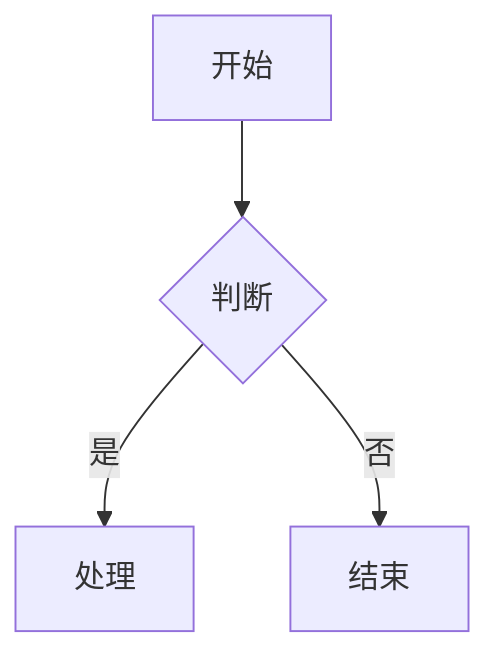

## 概述

使用 Mermaid 语法绘制业务流程图、状态图、时序图、架构图。

## 触发条件

当用户说出以下任意短语时激活：
- "流程图" "状态图" "时序图" "架构图" "流程梳理" "Mermaid"

## 工作流

### Step 1: 需求分析

确定图表类型和内容：
- 流程图：业务流程
- 状态图：状态转换
- 时序图：交互流程
- 架构图：系统架构

### Step 2: 数据收集

从项目文档提取关键信息：
- 业务流程节点
- 决策点
- 参与角色
- 数据流向

### Step 3: Mermaid 生成

生成 Mermaid 代码：

### Step 4: 渲染与导出

支持导出：
- SVG 矢量图
- PNG 图片
- 嵌入 Markdown

## 参考文件

- `references/mermaid-patterns.md` - Mermaid 模式库

## 反模式

- 图表过于复杂 → 单图节点不超过 20 个
- 不标注角色 → 流程图需标注每步的责任角色

## 上下文更新

- 写入：03_蓝图阶段/ 流程图/

