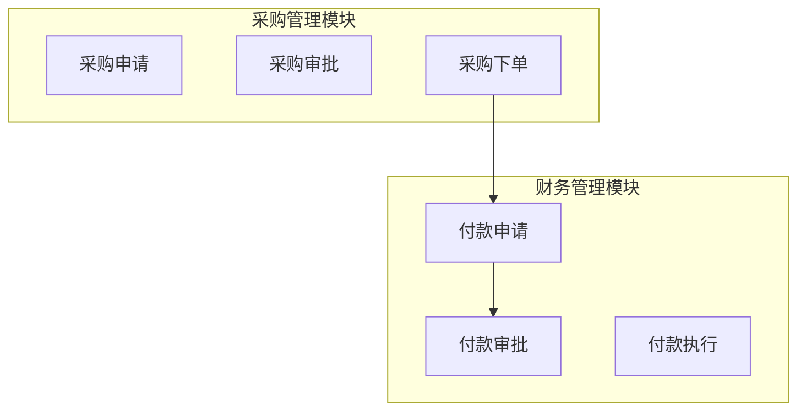
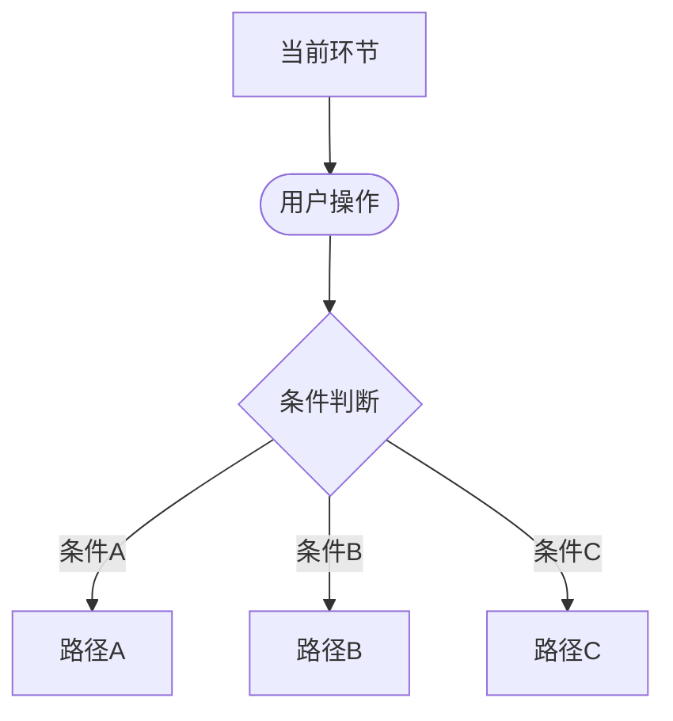
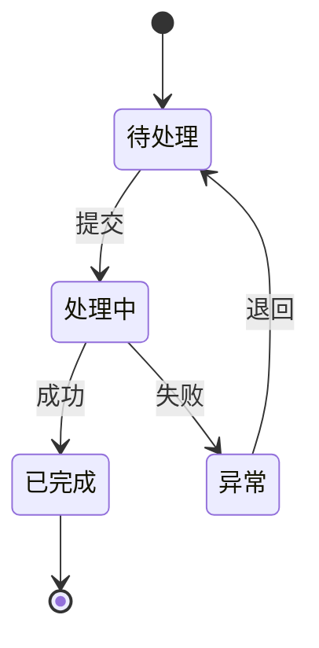
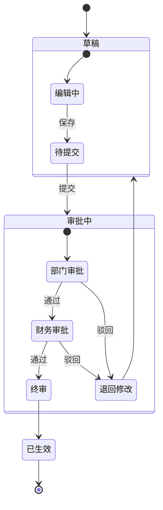
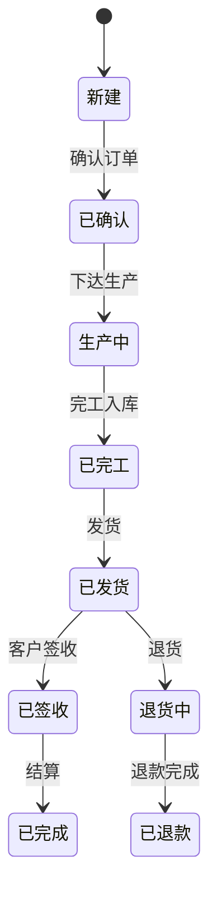
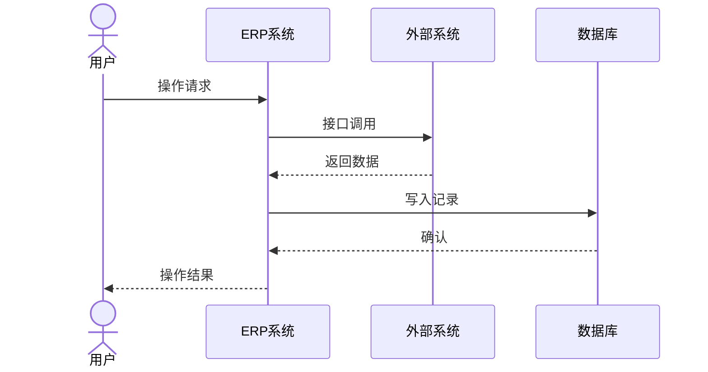
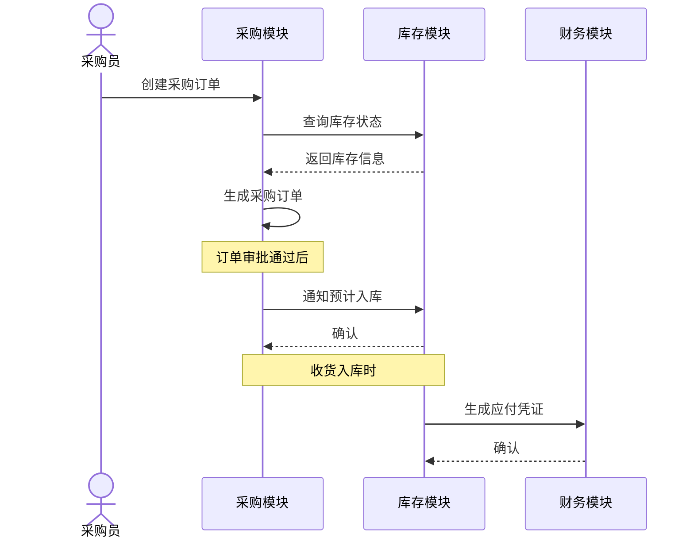
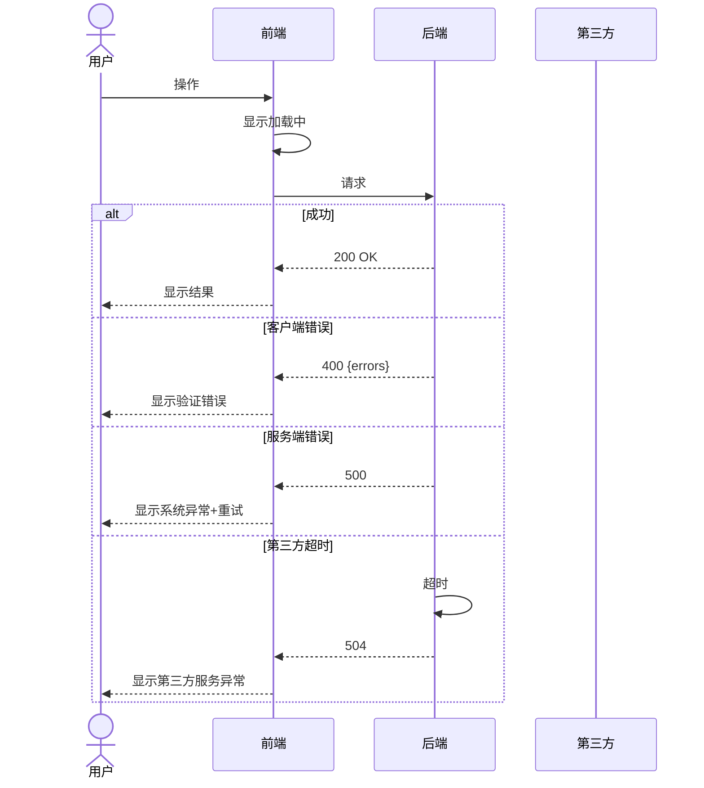

# Mermaid Diagram Patterns

Ready-to-use syntax patterns for ERP blueprint flow diagrams.

## Table of Contents

- [Flowchart Patterns](#flowchart-patterns)
- [State Diagram Patterns](#state-diagram-patterns)
- [Sequence Diagram Patterns](#sequence-diagram-patterns)
- [Best Practices](#best-practices)

---

## Flowchart Patterns

### Node Shapes

```
[节点名称]            — 矩形: 流程节点/系统模块
{判断条件?}           — 菱形: 条件分支/审批判断
((开始/结束))         — 圆形: 流程起止
([操作])              — 体育场形: 用户操作/手动步骤
[[子流程]]            — 子流程: 链接到另一个图
>结果]                — 非对称: 输出/结果
```

### Subgraphs for Grouping



### Complete Approval Flow Example

```mermaid
graph TD
    Start((开始)) --> Submit[提交申请]
    Submit --> DeptCheck{部门负责人审批}
    DeptCheck -->|通过| AmountCheck{金额>10万?}
    DeptCheck -->|驳回| Submit
    AmountCheck -->|是| VPApprove[VP审批]
    AmountCheck -->|否| FinanceCheck{财务审批}
    VPApprove --> FinanceCheck
    FinanceCheck -->|通过| Done[流程结束]
    FinanceCheck -->|驳回| Submit

    classDef process fill:#e1f5fe,stroke:#0288d1,stroke-width:2px
    classDef decision fill:#fff9c4,stroke:#fbc02d,stroke-width:2px
    classDef start fill:#c8e6c9,stroke:#388e3c,stroke-width:2px
    class Submit,Done classDef process
    class DeptCheck,AmountCheck,FinanceCheck,VPApprove decision
    class Start start
```

### Decision Branches



---

## State Diagram Patterns

### Basic State Transitions



### Complex Business Object States



### Order Lifecycle Example



---

## Sequence Diagram Patterns

### Basic System Interaction



### ERP Module Interaction Example



### Error Handling Pattern



---

## Best Practices

### Diagram Size
- Max 15-20 nodes per diagram
- More complex → split into sub-flows with cross-references
- Use subgraphs to group related nodes (max 3-4 subgraphs)

### Splitting Complex Flows
When a flow exceeds 20 nodes:
1. Identify logical boundaries (by module, by role, by phase)
2. Create a high-level flow with `[[子流程]]` nodes
3. Create separate detailed diagrams for each sub-flow
4. Link with a note: `详见: 采购-to-be/flow.md`

### Consistent Styling
```mermaid
classDef process fill:#e1f5fe,stroke:#0288d1,stroke-width:2px
classDef decision fill:#fff9c4,stroke:#fbc02d,stroke-width:2px
classDef system fill:#e8e8e8,stroke:#999,stroke-width:2px
classDef start fill:#c8e6c9,stroke:#388e3c,stroke-width:2px
classDef error fill:#ffebee,stroke:#d32f2f,stroke-width:1px
```

### Naming Conventions
- Process nodes: descriptive Chinese names — `采购申请`, `财务审批`
- Decisions: question format — `金额>10万?`, `是否通过?`
- States: Chinese status names — `待处理`, `审批中`, `已完成`
- Edges: short Chinese labels — `通过`, `驳回`, `提交`

### File Naming
- kebab-case or Chinese: `as-is-flow.md`, `to-be-flow.md`
- By module: `purchase-flow.md`, `finance-flow.md`
